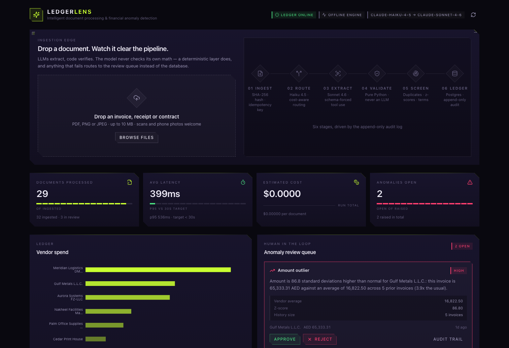
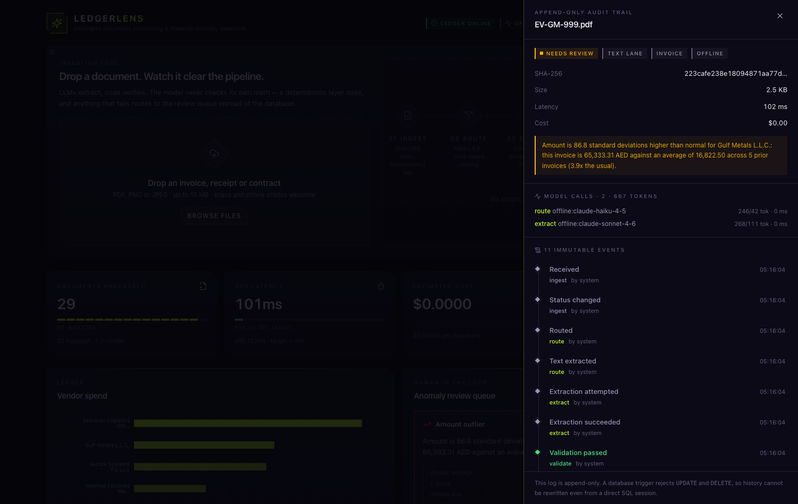
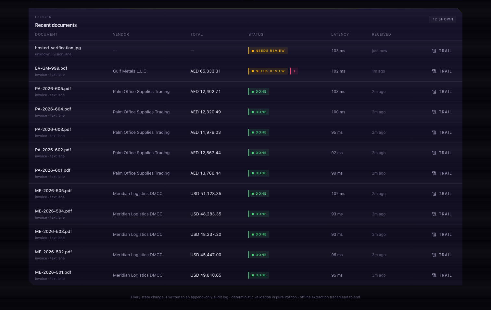
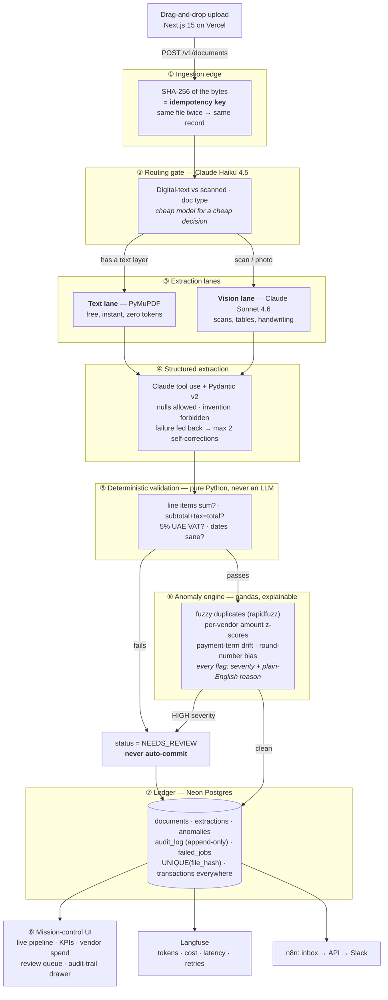

# LedgerLens

**Invoices in, verified data out — or a human review queue. Never a confident guess.**

[](https://github.com/Abdr007/ledgerlens/actions/workflows/ci.yml)

-c8ff2f)


**[▸ Live dashboard — ledgerlens-jet.vercel.app](https://ledgerlens-jet.vercel.app)** ·
[API health](https://Abdr007-ledgerlens.hf.space/health) ·
[OpenAPI](https://Abdr007-ledgerlens.hf.space/docs)



> **LLMs extract, code verifies.** The model never checks its own math — a deterministic
> validation layer does, and anything that fails routes to a human review queue instead of
> the database.

That sentence is the whole product. A vision model is very good at reading a smudged
invoice and very willing to tell you `subtotal + tax = total` when it does not. So the
model is given exactly one job — transcribe what is printed — and is **explicitly
forbidden from fixing arithmetic**, because an invoice whose own maths is wrong is not a
transcription problem, it is the finding. Pure Python then re-does every sum in `Decimal`,
and a document that fails is never auto-committed.

Finance teams re-type invoice data by hand and miss duplicate or inflated charges.
LedgerLens ingests any document — digital PDF, scan, or phone photo — extracts every field
into schema-validated structured data, verifies the arithmetic deterministically, screens
it against vendor history, and streams the whole journey onto a live dashboard.

<table>
<tr>
<td width="50%"><br><sub><b>Every state change is evidence.</b> Eleven immutable events, the model calls that produced them with their token counts, and a database trigger that rejects <code>UPDATE</code> and <code>DELETE</code> — so the history survives a direct <code>psql</code> session.</sub></td>
<td width="50%"><br><sub><b>The top row is the point.</b> A phone photo with no text layer, read by nobody, vendor <code>—</code> and total <code>—</code>: <b>NEEDS REVIEW</b>. It did not invent a number to fill the column.</sub></td>
</tr>
</table>

---

## Architecture



### The design decisions worth defending

| Decision | Why |
|---|---|
| **The model transcribes; it must not compute.** The extraction prompt explicitly forbids fixing arithmetic. | If an invoice's own maths is wrong, that is a *finding*. A model that silently "corrects" it destroys the exact signal the product exists to catch. |
| **The lane is measured, not inferred.** Haiku classifies the document *type*; whether a text layer exists is decided by PyMuPDF. | Whether a PDF carries extractable text is a fact we can measure for free. Routing a text-less PDF into the free lane guarantees an empty extraction. |
| **`UNIQUE(file_hash)` + `INSERT … ON CONFLICT`,** not read-then-write. | Two browser tabs racing the same file interleave a read-then-write. The database decides the winner; the application does not get a vote. |
| **A conditional `UPDATE … WHERE status = 'PENDING'`** claims a document. | Exactly one caller sees a row come back, so concurrent processing is impossible even across processes. |
| **The audit log is append-only in the database,** via a trigger that raises on `UPDATE`/`DELETE`. | An append-only log enforced only in application code is a convention. Enforced in the database, it survives a direct `psql` session. |
| **Two failure kinds, two destinations.** Content we read but must not auto-commit → `NEEDS_REVIEW`. Infrastructure that would not answer → `failed_jobs` + `FAILED`. | Mixing them makes both alarms useless. |
| **The self-correction turn re-attaches the document.** | Each attempt is a stateless request. Sending only the rejection asks the model to "re-read" a page it can no longer see — and the only honest answer to that is a payload full of nulls. *(This was a real bug the evaluation harness caught; see AUDIT.md.)* |
| **Reads and writes have separate rate limits.** | The spec's 10 req/min/IP protects the expensive ingestion path. Applying it to reads would break the pipeline visual, which polls roughly once a second, while protecting nothing. |

---

## Quickstart

**Prerequisites:** Docker, Python 3.12, Node 20+.

```bash
git clone https://github.com/Abdr007/ledgerlens && cd ledgerlens
cp .env.example .env          # works as-is; add keys when you have them

make setup                    # both toolchains
make up                       # PostgreSQL on :5433
make seed                     # 30 invoices, 6 vendors, 1 planted duplicate
make dev                      # API :7860 · UI :3000
```

Open <http://localhost:3000>. The dashboard is already populated, and the review queue
already holds the planted near-duplicate.

### It works with no API key

**Everything still runs.** With no `ANTHROPIC_API_KEY`, the service switches to a
deterministic, network-free extraction engine: a real rule-based parser over the document's
real extracted text. Hashing, routing, validation, anomaly screening, persistence, the audit
trail and the UI are all exercised for real — only the model call is substituted, and every
trace is stamped `mode: "offline"` so a baseline number can never be mistaken for a live one.

The honest limitation is surfaced rather than hidden: a photograph with no text layer yields
nulls, fails the presence checks and routes to `NEEDS_REVIEW` — the correct outcome for
"we could not read this without a vision model". That is the top row of the ledger
screenshot above, and it is not an error state. Add a key and those documents flow through
the Claude vision lane.

```bash
echo 'ANTHROPIC_API_KEY=sk-ant-…' >> .env    # that is the whole migration
```

---

## Verification

Nothing in this section is asserted. Every number below is printed by a command in this
repository, and the commands are the ones CI runs.

```bash
make audit           # ruff · mypy --strict · pytest · tsc --noEmit · eslint · next build
make eval            # field-level accuracy + anomaly precision/recall
make verify-hosted   # 11 checks against the running deployment
```

`make eval` renders the labelled test set as **real** PDFs and degraded scans, pushes them
through the **real** pipeline, and scores each field with a type-aware comparison. Ground
truth comes from the generator's specs, never read back from the rendered document, so the
harness scores extraction rather than grading its own homework.

| Metric | Result |
|---|---|
| Overall field accuracy | **100.0%** (63/63) |
| Line-item accuracy | **100.0%** (23/23) |
| Anomaly precision / recall / F1 | **100% / 100% / 1.00** |
| Tests | **137**, on real PostgreSQL, 0 skipped |
| Container image | 546 MB, non-root (uid 1000), healthcheck green |

**Scope, stated precisely.** Those are **offline-baseline** numbers over the **7 of 10**
documents that mode can read. The other 3 are scans with no text layer: without a vision
model there is nothing to read, and the pipeline correctly routed them to `NEEDS_REVIEW`
rather than inventing fields. They are excluded from scoring and named in the report, which
records `"mode": "offline"` so an offline figure can never be mistaken for a live one.

Live, in-region pipeline latency across the deployed ledger: **avg 399 ms, p95 536 ms**
(read from `/v1/stats`, which is also what the KPI cards show).

See [AUDIT.md](./AUDIT.md) for every gate with its result, including the defects found by
running against hosted infrastructure rather than localhost.

---

## How it is actually deployed

Not hypothetically. These are the two hosts serving the links at the top of this file.

| | Host | Why |
|---|---|---|
| **API** | Hugging Face Docker Space | Needs a container and a persistent process. Covered by an existing PRO subscription, which includes unlimited Docker Spaces at no marginal cost |
| **Web** | Vercel | Static Next.js build; free tier, and the build is where the CSP is fixed |
| **Ledger** | Neon Postgres | 0.5 GB free tier. Serverless, so it suspends when idle |
| **Tracing** | Langfuse Cloud | 50k observations/month free. Optional — local tracing to `llm_traces` is always on |

```bash
# API — pushes this repo to the Space, which builds infra/Dockerfile
make deploy-space

# Web — set the variable BEFORE the first build, see below
cd apps/web
printf 'https://Abdr007-ledgerlens.hf.space' | vercel env add NEXT_PUBLIC_API_BASE_URL production
vercel --prod --yes
```

`make deploy-space` also applies the Space's non-secret configuration from
`SPACE_VARIABLES` in [`scripts/deploy_space.py`](scripts/deploy_space.py) — the CORS origin,
the proxy count, the rate limits. That dict is version-controlled and
`test_space_variables_validate_against_settings` builds a real `Settings` from it, so a
value production would reject fails a test rather than a remote build.

The four **secrets** are set by hand, once, under Space → Settings → Variables and secrets:
`DATABASE_URL`, `ANTHROPIC_API_KEY`, `LANGFUSE_PUBLIC_KEY`, `LANGFUSE_SECRET_KEY`. They are
deliberately not in this repository, which is public.

The full walkthrough — including the two mechanisms that have failed here, and what to do
when each does — is [docs/DEPLOY.md](docs/DEPLOY.md).

> **`NEXT_PUBLIC_API_BASE_URL` must exist before the first build.** `next.config.ts` derives
> the CSP's `connect-src` from it at *build* time. Deploy without it and the shipped policy
> pins `connect-src` to localhost, so the browser blocks every call — which looks exactly
> like an API outage and leaves nothing in the API logs, because no request ever leaves the
> page. `make verify-hosted` checks this.

The image honours `$PORT` and falls back to 7860, so it is not tied to this host.

> The Space sleeps after 48 hours idle and the Neon compute suspends sooner, so the first
> request after a quiet spell is slow and the rest are not. `make verify-hosted` warms both,
> which is why it is the thing to run before a demo rather than after.

### Why not a free tier?

It was on one. Render's free plan stops the container after roughly fifteen minutes idle,
so the live API took **52 seconds** to answer after a quiet spell — long enough that anyone
opening the demo link concluded it was broken before it replied. A demo that reads as an
outage is worse than no demo.

The repository previously also carried a Cloud Run walkthrough and a Terraform module for
it, neither of which had ever been applied. Both are gone, along with `render.yaml`: a
repository that carries configuration for hosts it does not use is not offering three
options, it is publishing two untested ones next to the real one with no way to tell which
is which. Recorded as **D-2** in
[docs/SPEC-CONFORMANCE.md](docs/SPEC-CONFORMANCE.md), because it is a deliberate deviation
from the build spec, which asked for all three.

### n8n — the automation showcase (optional)

```bash
docker run -d --name n8n -p 5678:5678 -v n8n_data:/home/node/.n8n docker.n8n.io/n8nio/n8n
```

Import `automation/n8n/ledgerlens-invoice-inbox.json`, set `LEDGERLENS_API_URL`,
`LEDGERLENS_WEB_URL` and `SLACK_WEBHOOK_URL`. It watches an AP mailbox, filters attachments
to the accepted whitelist, uploads them, waits for the pipeline, and alerts Slack **only**
when a document needs a human — an alert that fires on everything gets muted within a week.

---

## API

Interactive docs at **`/docs`**; the OpenAPI document is at `/openapi.json`.

| Method | Path | Purpose |
|---|---|---|
| `POST` | `/v1/documents` | Upload. Returns `202` with the SHA-256 and whether it was a duplicate. |
| `GET` | `/v1/documents/{id}/status` | Drives the pipeline visual. Stage states are projected from the audit log. |
| `GET` | `/v1/documents/{id}` | Extraction, anomalies, audit trail and model traces. |
| `GET` | `/v1/documents/{id}/audit` | The append-only trail. |
| `GET` | `/v1/documents/{id}/traces` | Tokens, cost, latency and retries per model call. |
| `GET` | `/v1/documents` | Paginated ledger. |
| `GET` | `/v1/anomalies` | The review queue. |
| `POST` | `/v1/anomalies/{id}/resolve` | Approve / reject; writes back and appends to the trail. |
| `GET` | `/v1/stats` | KPI cards and vendor spend. |
| `GET` | `/health` | Reports `degraded` rather than failing when the database goes away. |

Every error is the same envelope — never a stack trace:

```json
{ "error": { "code": "file_too_large", "message": "File exceeds the 10 MB limit.", "details": { "max_bytes": 10485760 } } }
```

---

## Repository layout

```
ledgerlens/
├─ apps/
│  ├─ web/                     Next.js 15 · TypeScript · Tailwind v4 · Framer Motion · Recharts
│  └─ api/
│     ├─ app/
│     │  ├─ core/              settings · Claude client · db · retries · tracing · logging · files
│     │  ├─ models/            Pydantic schemas · SQLAlchemy tables · enums · API models
│     │  ├─ pipeline/          route · textlane · extract · validate · anomaly · orchestrator · prompts
│     │  ├─ routers/           documents · anomalies · stats · health · projections · rate limits
│     │  └─ devtools/          document generator + corpora (never imported by the request path)
│     ├─ scripts/seed.py       30 invoices through the real pipeline
│     └─ tests/                137 tests · unit + integration on real PostgreSQL
├─ eval/run_eval.py            field accuracy + anomaly precision/recall
├─ scripts/                    deploy_space · verify_hosted · shot (README screenshots)
├─ automation/n8n/             exported workflow
├─ infra/                      Dockerfile · docker-compose.dev.yml
├─ docs/DEPLOY.md              how the Space and Vercel are actually deployed
├─ docs/SPEC-CONFORMANCE.md    every spec requirement, mapped to where it lives
├─ DEMO.md                     the walkthrough, and a timed video script
├─ AUDIT.md                    every gate, with results
└─ Makefile
```

---

## Production quality bar

| Category | How it is met |
|---|---|
| **Race conditions** | `UNIQUE(file_hash)` + `INSERT … ON CONFLICT DO NOTHING`; every multi-step write in one transaction; status transitions enforced by a conditional `UPDATE` and a legal-transition table. Proven by tests that fire 8 concurrent uploads and 6 concurrent processors. |
| **Idempotency** | Re-uploading identical bytes returns the existing record and does not reprocess. Retried calls never duplicate rows. Asserted against the live deployment on every `make verify-hosted`. |
| **Error handling** | Every outbound call has a per-attempt timeout and 3 attempts with full-jitter backoff; only transient errors are retried. Exhausted budgets land in `failed_jobs` with a reason. Typed error responses, never stack traces. |
| **Security** | Magic-byte file whitelist (PDF/PNG/JPEG, ≤10 MB) that overrides the client's declared type; filename sanitisation (path traversal, control characters, bidi overrides); PDF page and pixel bombs capped; prompt-injection hardening stated explicitly in the system prompt with the document fenced as untrusted data; 10 req/min/IP on ingestion; CORS locked; full CSP and security headers; secrets redacted from every log line. |
| **Zero warnings** | ruff + mypy `--strict` clean on the API *and* on `scripts/`; eslint + `tsc --noEmit` clean on the web; pytest green with `filterwarnings = ["error"]`. |
| **Evaluation** | `eval/` scores a labelled set through the real pipeline and reports which mode produced the numbers. |
| **Deployment** | Built, booted against real PostgreSQL and probed by CI on every push; verified from outside by 11 assertions against the running stack. |

---

## Learning path

Read the codebase in this order — it is the order an interviewer will probe:

1. `app/pipeline/route.py` — cost-aware model routing, and why the lane is measured not inferred
2. `app/pipeline/extract.py` — forced tool use, the self-correction loop, hallucination control
3. `app/pipeline/validate.py` — why validation is deterministic, and how each tolerance is derived
4. `app/pipeline/anomaly.py` — z-scores, fuzzy vendor matching, and the dispersion floor
5. `app/pipeline/orchestrator.py` — the state machine, transactions and the failure taxonomy
6. `eval/run_eval.py` — how the numbers are produced, and what is excluded from them

Presenting it? [DEMO.md](./DEMO.md) is the run of show, including the shot that sells it.

## Licence

MIT.
