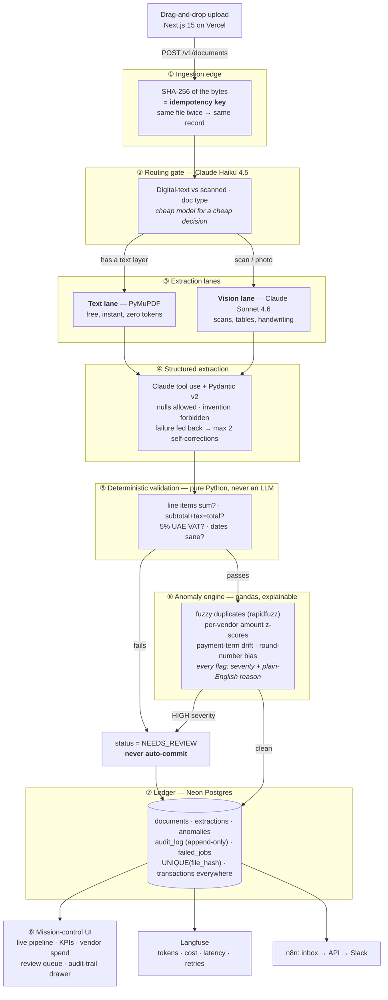

# LedgerLens

**Intelligent Document Processing & Financial Anomaly Detection Platform**

Vision-LLM extraction with deterministic validation, explainable anomaly detection and a
full audit trail — solving duplicate-payment and manual-entry losses.

> **LLMs extract, code verifies.** The model never checks its own math — a deterministic
> validation layer does, and anything that fails routes to a human review queue instead of
> the database.

Finance teams re-type invoice and contract data by hand and miss duplicate or inflated
charges. LedgerLens ingests any document — digital PDF, scan, or phone photo — extracts
every field into schema-validated structured data, verifies the arithmetic deterministically,
screens it against vendor history for anomalies, and streams the whole journey onto a live
dashboard. Per-document handling drops from ~15 minutes to under 30 seconds, and nothing
suspicious gets paid silently.

---

## Architecture



### The design decisions worth defending

| Decision | Why |
|---|---|
| **The model transcribes; it must not compute.** The extraction prompt explicitly forbids fixing arithmetic. | If an invoice's own maths is wrong, that is a *finding*. A model that silently "corrects" it destroys the exact signal the product exists to catch. |
| **The lane is measured, not inferred.** Haiku classifies the document *type*; whether a text layer exists is decided by PyMuPDF. | Whether a PDF carries extractable text is a fact we can measure for free. Routing a text-less PDF into the free lane guarantees an empty extraction. |
| **`UNIQUE(file_hash)` + `INSERT … ON CONFLICT`,** not read-then-write. | Two browser tabs racing the same file interleave a read-then-write. The database decides the winner; the application does not get a vote. |
| **A conditional `UPDATE … WHERE status = 'PENDING'`** claims a document. | Exactly one caller sees a row come back, so concurrent processing is impossible even across processes. |
| **The audit log is append-only in the database,** via a trigger that raises on `UPDATE`/`DELETE`. | An append-only log enforced only in application code is a convention. Enforced in the database, it survives a direct `psql` session. |
| **Two failure kinds, two destinations.** Content we read but must not auto-commit → `NEEDS_REVIEW`. Infrastructure that would not answer → `failed_jobs` + `FAILED`. | Mixing them makes both alarms useless. |
| **The self-correction turn re-attaches the document.** | Each attempt is a stateless request. Sending only the rejection asks the model to "re-read" a page it can no longer see — and the only honest answer to that is a payload full of nulls. *(This was a real bug the evaluation harness caught; see AUDIT.md.)* |
| **Reads and writes have separate rate limits.** | The spec's 10 req/min/IP protects the expensive ingestion path. Applying it to reads would break the pipeline visual, which polls roughly once a second, while protecting nothing. |

---

## Quickstart

**Prerequisites:** Docker, Python 3.12, Node 20+.

```bash
git clone <your-repo> ledgerlens && cd ledgerlens
cp .env.example .env          # works as-is; add keys when you have them

make setup                    # both toolchains
make up                       # PostgreSQL on :5433
make seed                     # 30 invoices, 6 vendors, 1 planted duplicate
make dev                      # API :7860 · UI :3000
```

Open <http://localhost:3000>. The dashboard is already populated, and the review queue
already holds the planted near-duplicate.

### No Claude API key yet?

**Everything still runs.** With no `ANTHROPIC_API_KEY`, the service switches to a
deterministic, network-free extraction engine: a real rule-based parser over the document's
real extracted text. Hashing, routing, validation, anomaly screening, persistence, the audit
trail and the UI are all exercised for real — only the model call is substituted, and every
trace is stamped `mode: "offline"` so a baseline number can never be mistaken for a live one.

The honest limitation is surfaced rather than hidden: a photograph with no text layer yields
nulls, fails the presence checks and routes to `NEEDS_REVIEW` — the correct outcome for
"we could not read this without a vision model". Add a key and those documents flow through
the Claude vision lane.

```bash
echo 'ANTHROPIC_API_KEY=sk-ant-…' >> .env    # that is the whole migration
```

---

## Verification

```bash
make audit     # ruff · mypy --strict · pytest · tsc --noEmit · eslint · next build
make eval      # field-level accuracy + anomaly precision/recall
```

`make eval` renders the labelled test set as **real** PDFs and degraded scans, pushes them
through the **real** pipeline, and scores each field with a type-aware comparison. The
numbers it prints are the numbers that belong on a résumé. See [AUDIT.md](./AUDIT.md) for the
full result of every gate.

---

## Free deployment

Everything below is a free tier. The only variable cost is your Claude key — pennies for a
whole demo.

| Service | Free allowance | What runs there |
|---|---|---|
| **Vercel Hobby** | 100 GB bandwidth/month | The Next.js UI |
| **GCP Cloud Run** | 2M requests + 360k GB-s/month, always free | The API container *(primary)* |
| **Hugging Face Spaces** | Docker Space, 2 vCPU / 16 GB | The API container *(no-card fallback)* |
| **Neon** | 0.5 GB Postgres | The ledger |
| **Langfuse Cloud** | 50k observations/month | LLM tracing |
| **n8n** | Self-hosted, local Docker | Inbox → API → Slack |

### 1. Neon — the ledger

1. Create a project at <https://console.neon.tech>.
2. Copy the **pooled** connection string.
3. `DATABASE_URL=postgresql://…` — `postgres://` and `postgresql://` are both rewritten to
   the asyncpg driver automatically, and `sslmode=require` is handled for you.

The schema is created on first boot, including the append-only trigger. No migration step.

### 2. Langfuse — tracing (optional)

<https://cloud.langfuse.com> → Settings → API Keys → set `LANGFUSE_PUBLIC_KEY` and
`LANGFUSE_SECRET_KEY`. Local tracing to the `llm_traces` table is always on regardless, so
the observability panel works with zero third-party accounts.

### 3a. GCP Cloud Run — the API (primary)

```bash
export PROJECT_ID=your-project
export REGION=europe-west1
gcloud config set project "$PROJECT_ID"
gcloud services enable run.googleapis.com artifactregistry.googleapis.com secretmanager.googleapis.com

gcloud artifacts repositories create ledgerlens --repository-format=docker --location="$REGION"
gcloud auth configure-docker "$REGION-docker.pkg.dev"

IMAGE="$REGION-docker.pkg.dev/$PROJECT_ID/ledgerlens/api:1.0.0"
docker build -f infra/Dockerfile -t "$IMAGE" .
docker push "$IMAGE"

for s in anthropic-api-key database-url langfuse-public-key langfuse-secret-key; do
  gcloud secrets create "ledgerlens-$s" --replication-policy=automatic 2>/dev/null || true
done
printf '%s' "$ANTHROPIC_API_KEY" | gcloud secrets versions add ledgerlens-anthropic-api-key --data-file=-
printf '%s' "$DATABASE_URL"      | gcloud secrets versions add ledgerlens-database-url --data-file=-

gcloud run deploy ledgerlens-api \
  --image "$IMAGE" --region "$REGION" --platform managed --allow-unauthenticated \
  --port 7860 --memory 512Mi --cpu 1 --min-instances 0 --max-instances 2 --cpu-boost \
  --set-env-vars "ENVIRONMENT=prod,ALLOWED_ORIGINS=https://ledgerlens.vercel.app,TRUSTED_PROXY_COUNT=1" \
  --set-secrets "ANTHROPIC_API_KEY=ledgerlens-anthropic-api-key:latest,DATABASE_URL=ledgerlens-database-url:latest"

gcloud run services describe ledgerlens-api --region "$REGION" --format='value(status.url)'
```

`--min-instances 0` means an idle service costs nothing; the first request after an idle
period pays a cold start.

#### …or declaratively, with Terraform

```bash
cd infra/terraform
terraform init
terraform apply -var project_id="$PROJECT_ID" -var image="$IMAGE" \
                -var allowed_origins="https://ledgerlens.vercel.app"
```

Provisions the Cloud Run service, a **least-privilege** runtime service account (not the
project-Editor default), the Secret Manager entries and the IAM bindings. Secret *values* are
never in Terraform state — `terraform output next_steps` prints the commands to add them.

### 3b. Hugging Face Spaces — the API (no-card fallback)

Cloud Run needs a card on file even inside the free tier. Spaces does not.

1. Create a **Docker** Space.
2. Copy `infra/Dockerfile` to the Space root and push `apps/api/`.
3. Space settings → Variables and secrets → `DATABASE_URL`, `ANTHROPIC_API_KEY`,
   `ALLOWED_ORIGINS`, `TRUSTED_PROXY_COUNT=1`.

The image already listens on **7860**, which is what Spaces requires. It also honours
`$PORT`, so the same image serves Cloud Run. Free Spaces sleep when idle — wake it before a
demo.

### 4. Vercel — the UI

```bash
cd apps/web
vercel link
vercel env add NEXT_PUBLIC_API_BASE_URL production   # the Cloud Run / Spaces URL
vercel --prod
```

Then set `ALLOWED_ORIGINS` on the API to your Vercel domain and redeploy. **CORS is locked to
that origin — there is no wildcard**, so this step is required, not optional.

### 5. n8n — the automation showcase (optional)

```bash
docker run -d --name n8n -p 5678:5678 -v n8n_data:/home/node/.n8n docker.n8n.io/n8nio/n8n
```

Import `automation/n8n/ledgerlens-invoice-inbox.json`, set `LEDGERLENS_API_URL`,
`LEDGERLENS_WEB_URL` and `SLACK_WEBHOOK_URL`. It watches an AP mailbox, filters attachments
to the accepted whitelist, uploads them, waits for the pipeline, and alerts Slack **only**
when a document needs a human — an alert that fires on everything gets muted within a week.

---

## API

Interactive docs at **`/docs`**; the OpenAPI document is at `/openapi.json`.

| Method | Path | Purpose |
|---|---|---|
| `POST` | `/v1/documents` | Upload. Returns `202` with the SHA-256 and whether it was a duplicate. |
| `GET` | `/v1/documents/{id}/status` | Drives the pipeline visual. Stage states are projected from the audit log. |
| `GET` | `/v1/documents/{id}` | Extraction, anomalies, audit trail and model traces. |
| `GET` | `/v1/documents/{id}/audit` | The append-only trail. |
| `GET` | `/v1/documents/{id}/traces` | Tokens, cost, latency and retries per model call. |
| `GET` | `/v1/documents` | Paginated ledger. |
| `GET` | `/v1/anomalies` | The review queue. |
| `POST` | `/v1/anomalies/{id}/resolve` | Approve / reject; writes back and appends to the trail. |
| `GET` | `/v1/stats` | KPI cards and vendor spend. |
| `GET` | `/health` | Reports `degraded` rather than failing when the database is down. |

Every error is the same envelope — never a stack trace:

```json
{ "error": { "code": "file_too_large", "message": "File exceeds the 10 MB limit.", "details": { "max_bytes": 10485760 } } }
```

---

## Repository layout

```
ledgerlens/
├─ apps/
│  ├─ web/                     Next.js 15 · TypeScript · Tailwind v4 · Framer Motion · Recharts
│  └─ api/
│     ├─ app/
│     │  ├─ core/              settings · Claude client · db · retries · tracing · logging · files
│     │  ├─ models/            Pydantic schemas · SQLAlchemy tables · enums · API models
│     │  ├─ pipeline/          route · textlane · extract · validate · anomaly · orchestrator · prompts
│     │  ├─ routers/           documents · anomalies · stats · health · projections · rate limits
│     │  └─ devtools/          document generator + corpora (never imported by the request path)
│     ├─ scripts/seed.py       30 invoices through the real pipeline
│     └─ tests/                107 tests · unit + integration on real PostgreSQL
├─ eval/run_eval.py            field accuracy + anomaly precision/recall
├─ automation/n8n/             exported workflow
├─ infra/                      Dockerfile · docker-compose.dev.yml · vercel.json · terraform/
├─ docs/SPEC-CONFORMANCE.md    every spec requirement, mapped to where it lives
├─ AUDIT.md                    every gate, with results
└─ Makefile
```

---

## Production quality bar

| Category | How it is met |
|---|---|
| **Race conditions** | `UNIQUE(file_hash)` + `INSERT … ON CONFLICT DO NOTHING`; every multi-step write in one transaction; status transitions enforced by a conditional `UPDATE` and a legal-transition table. Proven by tests that fire 8 concurrent uploads and 6 concurrent processors. |
| **Idempotency** | Re-uploading identical bytes returns the existing record and does not reprocess. Retried calls never duplicate rows. |
| **Error handling** | Every outbound call has a per-attempt timeout and 3 attempts with full-jitter backoff; only transient errors are retried. Exhausted budgets land in `failed_jobs` with a reason. Typed error responses, never stack traces. |
| **Security** | Magic-byte file whitelist (PDF/PNG/JPEG, ≤10 MB) that overrides the client's declared type; filename sanitisation (path traversal, control characters, bidi overrides); PDF page and pixel bombs capped; prompt-injection hardening stated explicitly in the system prompt with the document fenced as untrusted data; 10 req/min/IP on ingestion; CORS locked; full CSP and security headers; secrets redacted from every log line. |
| **Zero warnings** | ruff + mypy `--strict` clean on the API; eslint + `tsc --noEmit` clean on the web; pytest green; no console errors. |
| **Evaluation** | `eval/` scores a labelled set through the real pipeline and reports which mode produced the numbers. |

---

## Learning path

Read the codebase in this order — it is the order an interviewer will probe:

1. `app/pipeline/route.py` — cost-aware model routing, and why the lane is measured not inferred
2. `app/pipeline/extract.py` — forced tool use, the self-correction loop, hallucination control
3. `app/pipeline/validate.py` — why validation is deterministic, and how each tolerance is derived
4. `app/pipeline/anomaly.py` — z-scores, fuzzy vendor matching, and the dispersion floor
5. `app/pipeline/orchestrator.py` — the state machine, transactions and the failure taxonomy
6. `eval/run_eval.py` — how the numbers are produced, and what is excluded from them

## Licence

MIT.
